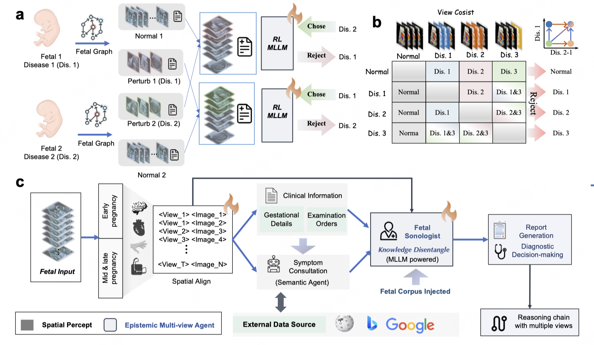
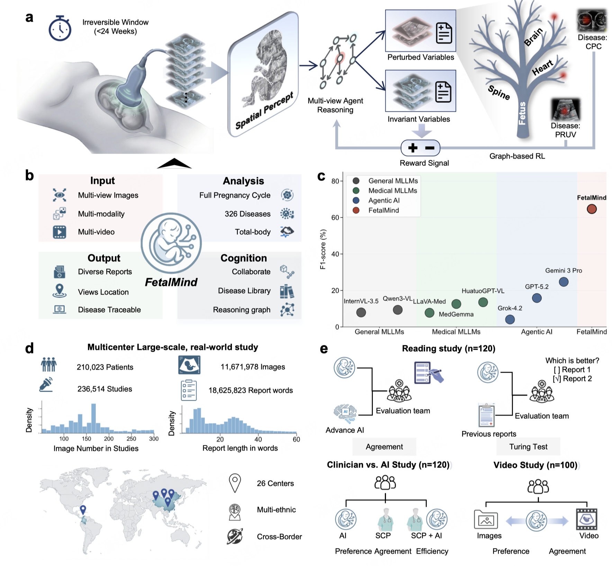

# An Epistemic Generalist AI System for Fetal Ultrasound Interpretation

[Xiao He](#)<sup>1,12*</sup>, [Huangxuan Zhao](#)<sup>1,12*†</sup>, [Linxia Wu](#)<sup>4*</sup>, [Jiancheng Pan](#)<sup>2</sup>, [Yingjie Wang](#)<sup>8</sup>, [Siyuan Liu](#)<sup>1,12</sup>, [Lei Chen](#)<sup>4</sup>, [Dongjing Shan](#)<sup>9</sup>, [Jiqing Xuan](#)<sup>10</sup>, [Wei Yu](#)<sup>11</sup>, [Chengcheng Zhu](#)<sup>5</sup>, [Yong Luo](#)<sup>1,12†</sup>, [Dacheng Tao](#)<sup>3†</sup>, and [Bo Du](#)<sup>1,12†</sup>

<sup>1</sup>School of Computer Science, Wuhan University, Hubei, China  
<sup>2</sup>Tsinghua University, Beijing, China  
<sup>3</sup>Nanyang Technological University, Singapore  
<sup>4</sup>Department of Radiology, Union Hospital, Tongji Medical College, Huazhong University of Science and Technology, China  
<sup>5</sup>University of Washington, Seattle, WA, USA  
<sup>8</sup>School of Artificial Intelligence, Wuhan University, Hubei, China  
<sup>9</sup>School of Medical Information and Engineering, Southwest Medical University, China  
<sup>10</sup>Department of Ultrasound, Affiliated Hospital of Southwest Medical University, China  
<sup>11</sup>School of Artificial Intelligence, Wuhan University, Hubei, China  
<sup>12</sup>The National Engineering Research Center for Multimedia Software, Hubei, China  

<sup>*</sup>Equal contributions  <sup>†</sup>Corresponding author

<a href='https://arxiv.org/abs/2510.12953'></a> 
<a href=''></a> 
<a href='http://deepfetal.com/'></a>

> *DeepFetal is an epistemic multimodal AI system for full-gestation fetal ultrasound interpretation, enabling structured view understanding, traceable diagnostic reasoning, and robust clinical decision support.*


## News

- [2025/04/12] The new work of [DeepFetal]() have been released.

- [2025/10/16] The paper and project report of [FetalMind](https://arxiv.org/abs/2510.12953) have been released.

## Overview
Stillbirths represent a profound global health crisis, with approximately 2 million cases occurring annually. Fetal ultrasound serves as the primary clinical defense, supporting prenatal screening for over 200 million pregnant women worldwide and reducing perinatal mortality by 49.2%. However, achieving precise diagnosis throughout the entire gestation period remains highly challenging owing to fetal phenotypic heterogeneity, the low incidence of rare diseases, and variations in clinical expertise. Current artificial intelligence models focus on single-view medical imaging of adults, which fail to resolve inherent fetal ultrasound bottlenecks such as multi-view feature confounding, information overload, and disease diversity. Consequently, comprehensive decision support for full-gestation ultrasound remains largely unrealized in real-world clinical settings. Here we present DeepFetal, an epistemic multimodal agent system designed for full-gestation fetal ultrasound interpretation.



DeepFetal employs a progressive architecture that structures disordered image sequences into standard views, aligns clinical semantics with prior knowledge, and optimizes diagnostic decision-making. Furthermore, we introduce a graph-based epistemic disentanglement mechanism that separates true lesions from artifacts. This facilitates traceable reasoning, mitigates model hallucination, and allows for robust generalization to unseen disease combinations. We validated DeepFetal using the largest real-world cohort to date, comprising 246,231 patients and over 10 million images across 20 clinical centers. In core diagnostic benchmarks, DeepFetal outperformed eight advanced methods, by an F1-score of 38.63%. During real-world clinical validation, the system halved interpretation time, improved sensitivity by 28%, and enhanced reporting quality (score: 4.71 ± 0.03 versus 3.62 ± 0.07). Our work not only advances the field of fetal ultrasound but also reveals how multimodal large language model-driven systems can be endowed with cognitive understanding to reshape current clinical workflows.



For more detailed about our pipeline, please refer to our paper.


# Installation

This document provides a concise setup guide for running `deepfetal_code` for preprocessing and inference.

## Step 1: Clone the Repository

```bash
git clone <your-repo-url> deepfetal_code
cd deepfetal_code
```

## Step 2: Create the Python Environment

We recommend using Conda with Python 3.10.

```bash
conda create -n deepfetal python=3.10 -y
conda activate deepfetal
```

## Step 3: Install Dependencies

Install the project requirements into the active environment:

```bash
pip install -r requirements.txt
```

If you only plan to use the API backend and do not need local Swift inference, you may still keep the same environment for simplicity.

## Step 4: Prepare Required Files

Make sure the following directories and files are available:

```text
deepfetal_code/
├── run.sh
├── deepfetal/
├── config/
│   └── config.yaml
├── data/
│   ├── metadata/
│   └── samples/
├── checkpoints/
└── workspace/
```

Required assets:

- `data/metadata/pregnancy_stage.xlsx`
- `data/metadata/plane_translation.xlsx`
- your input ultrasound case folder under `data/samples/` or another custom path
- model checkpoints under `checkpoints/` if you use the local `swift` backend

## Step 5: Configure Environment Variables

Create a local environment file named `.env.local` in the project root.

Example configuration:

```bash
OPENAI_API_KEY=your_api_key
OPENAI_BASE_URL=https://api.openai.com/v1
OPENAI_MODEL=gpt-4.1-mini

MODE=all
INFER_BACKEND=api
USE_OPENAI_CONSTRAINT=0
```

Notes:

- `INFER_BACKEND=api` uses an OpenAI-compatible API for the final reasoning step.
- `INFER_BACKEND=swift` uses a local model from `checkpoints/`.
- `USE_OPENAI_CONSTRAINT=1` enables the optional image-constraint generation step before final inference.
- `USE_OPENAI_CONSTRAINT=0` skips that step.

## Step 6: Run the Pipeline

### Full Pipeline

```bash
conda activate deepfetal
bash run.sh
```

### Preprocess Only

```bash
MODE=process bash run.sh
```

### Inference Only

```bash
MODE=infer bash run.sh
```

### API Inference

```bash
MODE=infer \
INFER_BACKEND=api \
bash run.sh
```

### Local Swift Inference

```bash
MODE=infer \
INFER_BACKEND=swift \
CUDA_VISIBLE_DEVICES=0 \
bash run.sh
```

### Enable Optional OpenAI Constraint Injection

```bash
USE_OPENAI_CONSTRAINT=1 \
MODE=all \
INFER_BACKEND=api \
bash run.sh
```

## Step 7: Expected Outputs

Main intermediate and output files:

```text
workspace/
├── preprocess/
│   └── 5_1_ultrasound_reports_convert.jsonl
└── infer/
    ├── ultrasound_prompt_result.jsonl
    ├── final_result_api.jsonl
    └── final_result.jsonl
```

Output description:

- `workspace/infer/ultrasound_prompt_result.jsonl`: prompt file used for the second-stage inference
- `workspace/infer/final_result_api.jsonl`: final output from the API backend
- `workspace/infer/final_result.jsonl`: final output from the local Swift backend

## Step 8: Common Options

You can override the default paths and behavior with environment variables:

```bash
IMAGE_ROOT=./data/samples/PatientID704_ExamID10143_trimester2
WORKSPACE_DIR=./workspace
CONFIG_PATH=./config/config.yaml
EXCEL_PATH=./data/metadata/pregnancy_stage.xlsx
USE_OPENAI_CONSTRAINT=0
INFER_BACKEND=api
MODE=all
```

Example:

```bash
IMAGE_ROOT=./data/samples/your_case \
USE_OPENAI_CONSTRAINT=1 \
INFER_BACKEND=api \
MODE=all \
bash run.sh
```


## Minimal Quick Start

```bash
conda create -n deepfetal python=3.10 -y
conda activate deepfetal
pip install -r requirements.txt

cat > .env.local <<'EOF'
OPENAI_API_KEY=your_api_key
OPENAI_BASE_URL=https://api.openai.com/v1
OPENAI_MODEL=gpt-4.1-mini
MODE=all
INFER_BACKEND=api
USE_OPENAI_CONSTRAINT=0
EOF

bash run.sh
```

## Reference
```latex
@article{he2026deepfetal,
  title={An Epistemic Generalist AI System for Fetal Ultrasound Interpretation},
  author={He, Xiao and Zhao, Huangxuan and Wu, Linxia and Pan, Jiancheng and Wang, Yingjie and Liu, Siyuan and Chen, Lei and Shan, Dongjing and Xuan, Jiqing and Yu, Wei and Zhu, Chengcheng and Luo, Yong and Tao, Dacheng and Du, Bo},
  year={2026}
}

and

@misc{he2025fetalmind,
  title={Epistemic-aware Vision-Language Foundation Model for Fetal Ultrasound Interpretation}, 
  author={Xiao He, Huangxuan Zhao, Guojia Wan, Wei Zhou, Yanxing Liu, Juhua Liu, Yongchao Xu, Yong Luo, Dacheng Tao, and Bo Du},
  year={2025},
  eprint={2505.12953},
  archivePrefix={arXiv},
  primaryClass={cs.CV},
  url={https://arxiv.org/abs/2510.12953}, 
  } 
```

## Acknowledgement
We thank all the collaborators who supported the development and evaluation of DeepFetal. We also acknowledge the open-source community and prior research in medical imaging, multimodal learning, and large language models, which provided important foundations for this work.
